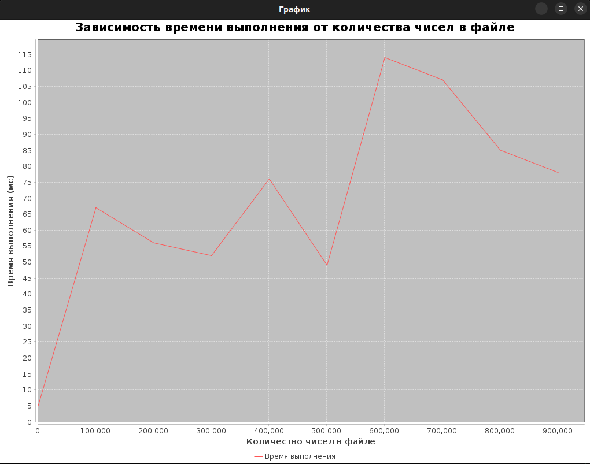

<h1 align="center"> Техническая документация </h1>
    

 

    <h3> Формат входных данных:</h3>
        
 Файл 'input.txt' располагается в одной директории с программой. 

        
 Целые числа в файле записаны в одной строке, друг от друга отделены пробелами. 
            В файле есть минимум одно число. Максимально возможное количество чисел в файле - 1 млн. 

    <h3> Формат выходных данных:</h3>
        
 <b> Пример работы программы </b> 
  
        
 В файле: 1 4 2 3 

        
 Минимальное: 1 

        
 Максимальное: 4 

        
 Сумма: 10 (1 + 2 + 3 + 4) 

        
 Произведение: 24 (1 * 2 * 3 * 4) 

    <h3> Лимит по времени:</h3>
        
 Не установлено. Завист от размера входного файла.

    <h3> Лимит по памяти:</h3>
        
 Не установлено. Зависит от размера входного файла.

    <h3> Функции программы: </h3>

1. `_min` - функция принимает на вход массив элементов и возвращает один элемент (int)минмиальное значение этого массива
2. `_max` - функция принимает на вход массив элементов и возвращает один элемент (int) максимальное значение этого массива
3. `_sum` - функция принимает на вход массив элементов и возвращает один элемент (int) сумму всех элементов этого массива 
4. `_mult` - функция принимает на вход массив элементов и возвращает один элемент (int) произведение всех элементов этого массива
5. `return_data` - функция принимает на вход имя файла с данными и возвращает возвращает массив с элементами файла (целые числа типа int). В аргументе функции задаётся дефолтное имя файла с данными - имя файла с данными, который будет проверяться тестами при заливе в репозиторий

MainTest.java Реализует тесты

NumberProcessorTest.java Реализует построение графика времени работы программы от кол-ва чисел во входном файле

К проекту подключена CI система. Программа проходит тесты при каждом push, есть возможность
ручного запуска тестов. Результат каждого теста отправляется в телеграмм канал.

Ниже представлен график зависимости времени выполнения программы от количества чисел в файле:

